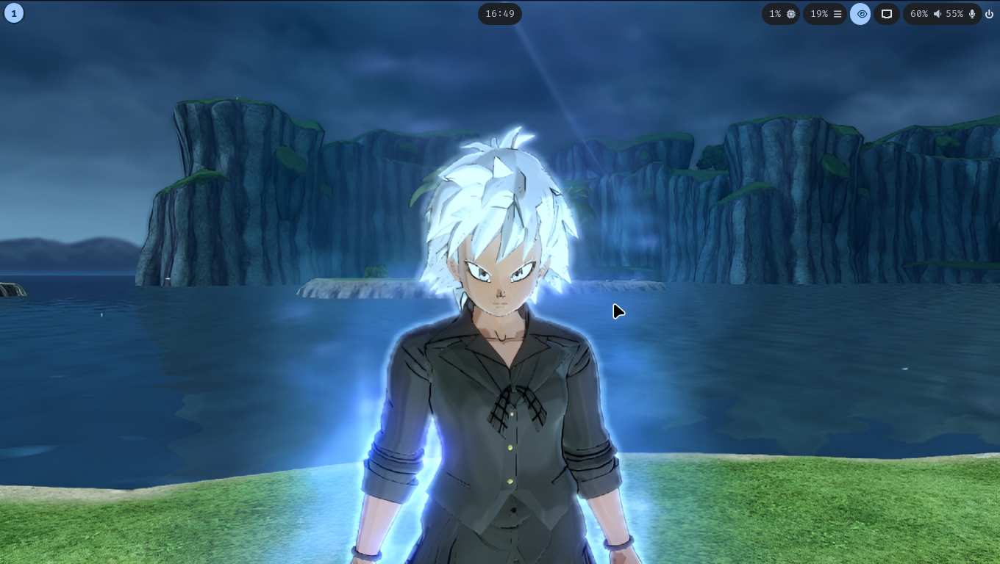
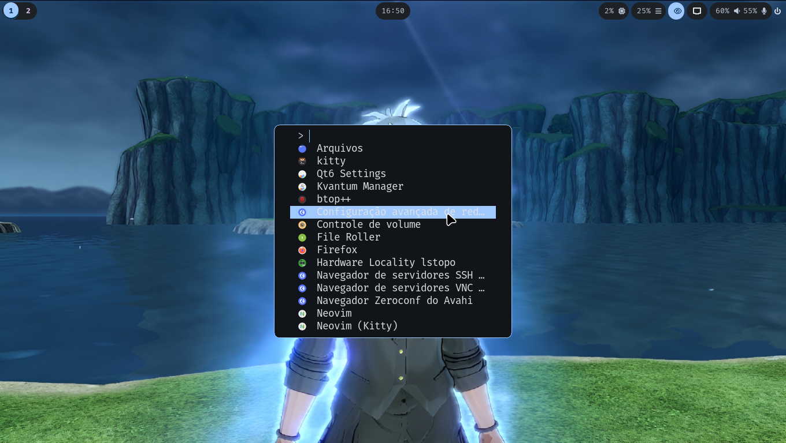
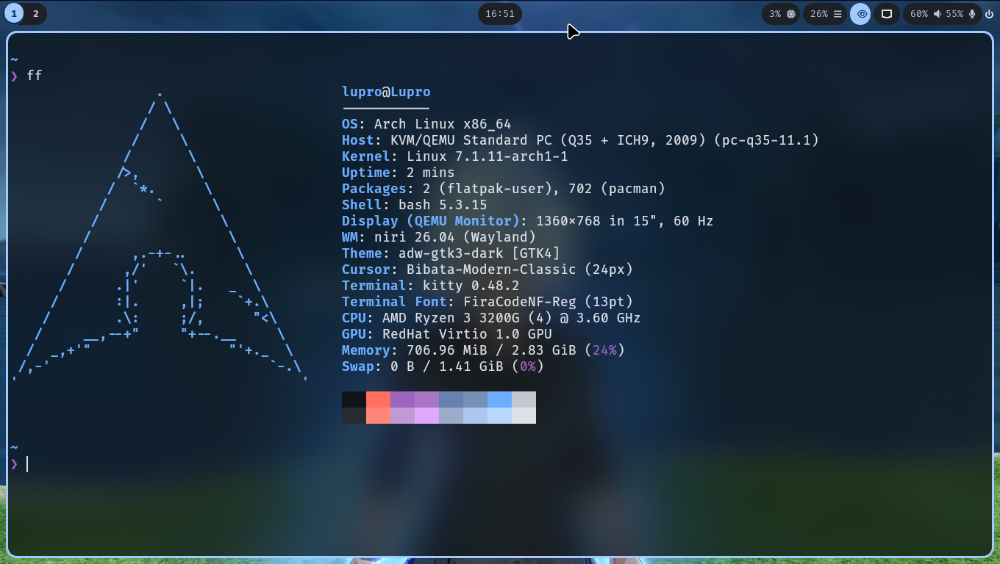

# NiriDotfiles

My dotfiles for a **[Niri](https://github.com/YaLTeR/niri)** (scrollable-tiling Wayland compositor) setup on **Arch Linux**, with a dynamic theme generated via **Matugen** based on the wallpaper.

## Preview

> ### Desktop



> ### Launcher



> ### Terminal




## Components

| Category | Tool |
|---|---|
| Compositor | [Niri](https://github.com/YaLTeR/niri) |
| Status bar | [Waybar](https://github.com/Alexays/Waybar) |
| Launcher | [Fuzzel](https://codeberg.org/dnkl/fuzzel) |
| Terminal | [Kitty](https://sw.kovidgoyal.net/kitty/) |
| Theme generation | [Matugen](https://github.com/InioX/matugen) |
| Wallpaper | swaybg |
| Xwayland | xwayland-satellite |
| Audio | PipeWire + WirePlumber + Pavucontrol |
| Notifications | swaync |
| Lock / idle | swaylock + swayidle |
| Clipboard | cliphist |
| File manager | Nautilus |
| Editor | Neovim ([LazyVim](https://github.com/LazyVim/starter)) |
| GTK theme | adw-gtk-theme (dark) |
| Icons | Tela Circle (blue, dark) |
| Cursor | [Bibata Modern Classic](https://github.com/ful1e5/Bibata_Cursor) |
| Shell prompt | Starship |
| Fonts | FiraCode Nerd Font, Noto Fonts |

## Repository structure

```
NiriDotfiles/
├── bash/
│   ├── .bashrc
├── fastfetch/
│   ├── .config/
│   │   ├── fastfetch/
│   │   │   ├── config.jsonc
├── fuzzel/
│   ├── .config/
│   │   ├── fuzzel/
│   │   │   ├── fuzzel.ini
├── gtk/
│   ├── .config/
│   │   ├── gtk-3.0/
│   │   │   ├── gtk.css
│   │   ├── gtk-4.0/
│   │   │   ├── gtk.css
│   │   │   ├── settings.ini
├── images/
│   ├── Img_Desktop.png
│   ├── Img_Launcher.png
│   ├── Img_Terminal.png
├── indextheme/
│   ├── .icons/
│   │   ├── default/
│   │   │   ├── index.theme
├── kdeglobals/
│   ├── .config/
│   │   ├── kdeglobals
├── kitty/
│   ├── .config/
│   │   ├── kitty/
│   │   │   ├── kitty.conf
├── Kvantum/
│   ├── .config/
│   │   ├── Kvantum/
│   │   │   ├── kvantum.kvconfig
├── matugen/
│   ├── .config/
│   │   ├── matugen/
│   │   │   ├── post-hook-scripts/
│   │   │   │   ├── gtk-themes-reload.sh
│   │   │   ├── templates/
│   │   │   │   ├── btop.theme
│   │   │   │   ├── colors.css
│   │   │   │   ├── fuzzel.ini
│   │   │   │   ├── gtk-colors.css
│   │   │   │   ├── kitty-colors.css
│   │   │   │   ├── kvantum-colors.kvconfig
│   │   │   │   ├── kvantum-colors.svg
│   │   │   │   ├── niri-colors.kdl
│   │   │   │   ├── qtct-colors.conf
│   │   │   │   ├── template.lua
│   │   │   │   ├── terminal-sequences
├── niri/
│   ├── .config/
│   │   ├── niri/
│   │   │   ├── config.kdl
├── nvim/
│   ├── .config/
│   │   ├── nvim/
│   │   │   ├── lua/
│   │   │   │   ├── config/
│   │   │   │   │   ├── matugen.lua
│   │   │   │   ├── plugins/
│   │   │   │   │   ├── base16.lua
├── nvim-kitty/
│   ├── .local/
│   │   ├── share/
│   │   │   ├── applications/
│   │   │   │   ├── nvim-kitty.desktop
├── qtct/
│   ├── .config/
│   │   ├── qt5ct/
│   │   │   ├── qt5ct.conf
│   │   ├── qt6ct/
│   │   │   ├── qt6ct.conf
├── swaync/
│   ├── .config/
│   │   ├── swaync/
│   │   │   ├── config.json
│   │   │   ├── configSchema.json
│   │   │   ├── style.css
├── wallpaper/
│   ├── Pictures/
│   │   ├── Wallpapers/
│   │   │   ├── Wallpaper.png
├── waybar/
│   ├── .config/
│   │   ├── waybar/
│   │   │   ├── scripts/
│   │   │   │   ├── power-menu.sh
│   │   │   ├── config.jsonc
│   │   │   ├── style.css
├── xdg-desktop-portal/
│   ├── .config/
│   │   ├── xdg-desktop-portal/
│   │   │   ├── niri-portals.conf
├── install.sh
└── README.md
```

Each folder is organized in the layout expected by [GNU Stow](https://www.gnu.org/software/stow/), ready to be symlinked into the user's `$HOME`.

## What `install.sh` does

1. **Installs the required packages** via `pacman` (Niri, Waybar, Fuzzel, Kitty, Matugen, PipeWire, Qt/GTK theming tools, fonts, system utilities, etc.).
2. **Adds the Flathub repository** to the user.
3. **Backs up existing configs** (`~/.bashrc`, `~/.icons/default/index.theme`, the current wallpaper, and the entire `~/.config`) to `~/Backups/<date>`.
4. **Installs the Bibata Modern Classic cursor** into `~/.local/share/icons`.
5. **Installs LazyVim** as the base Neovim configuration and hooks in the Matugen module.
6. **Applies the dotfiles** with `stow`, creating the symlinks in `$HOME`.
7. **Configures GTK/icon/cursor themes** via `gsettings` and installs the `adw-gtk3` theme via Flatpak.
8. **Sets Nautilus** as the default file manager.
9. **Generates the color theme with Matugen** from the wallpaper at `~/Pictures/Wallpapers/Wallpaper.png` (if it exists).
10. **Cleans up** temporary installation files.

## Requirements

- Arch Linux (or a `pacman`-compatible derivative)
- User with `sudo` privileges
- Internet connection (for packages, Flathub, and cloning LazyVim)

## Installation

```bash
git clone https://github.com/Luka13Dev/NiriDotfiles.git ~/NiriDotfiles
cd ~/NiriDotfiles
chmod +x install.sh
./install.sh
```

> ⚠️ The script moves the current contents of `~/.config` to a backup folder before applying the dotfiles. Review the script before running it on a machine with configs you don't want to lose.

### Wallpaper and dynamic theming

For Matugen to generate colors automatically during installation, place your image at:

```
~/Pictures/Wallpapers/Wallpaper.png
```

Otherwise, theme generation is skipped and can be run manually afterward with:

```bash
matugen image ~/Pictures/Wallpapers/Wallpaper.png
```

## License

Feel free to use, adapt, and distribute these dotfiles.
